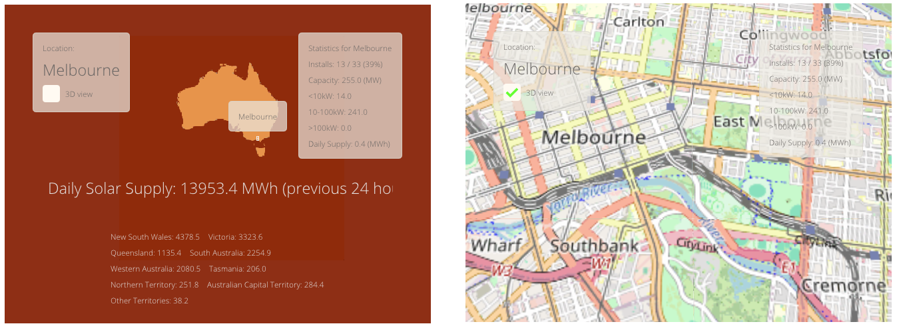
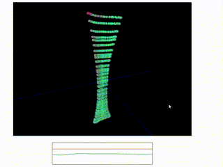

# Science Portfolio

Examples of my work that are either focused on research, web interfaces, or langages such as Python, Matlab and R. 

# Solar Supply

Solar Supply was a research project that I completed as part of my graduate program in computer science. 

There are two parts to the Solar Supply project, calculating the data and then visualising over a map. The first stage, data calculation, is done with a Python script using daily data for weather and solar installation by region. The second stage, which is visualisation, is handled by this github project. The visualisation and mapping shows the data together with the location. A representative view of the percentage of solar installation can be shown for each postcode area. 

The code for this repository: https://github.com/jnmaloney/SolarSupplyAu

and the live demo of this: https://jnmaloney.github.io/SolarSupplyAu/home.html

The code example shows reading and displaying from a dataset, with a 3d graphical interface. 

# Laser Simulation

# Yabbi

Yabbi is a biometrics tool for data visualisation and better rehabilitation. The Yabbi visualisation was developed over a weekend for Health Hack 2018.

https://github.com/HealthHackAu2018/yabbi

https://github.com/HealthHackAu2018/yabbi/tree/sockets

The software allows a user to visualise biometric data, with 3 dimensional and time-series components. Within the data, the client can look for excessive strain on the ligament. 

It is possible for the client to visualise data which is stored in a remote location. In this case, the data to be visualised can be served across a network. 

# Tetris

The classic arcade game, Tetris. I made this with a few libraries to demonstrate the multimedia capabilities of c++ on the web. By using c++ libraries which are available on github, we can develop an applicaion in the browser that is interactive with graphics and audio. 

# Turing Pattern

Turing is another example of interactive applications in the browser. The simulation is using differential equations to model the behaviour of a chemical "Turing pattern" which is known to produce both spotted and striped patterns in nature. This example shows how such a simulation could be implemented and rendered in the browser. 
